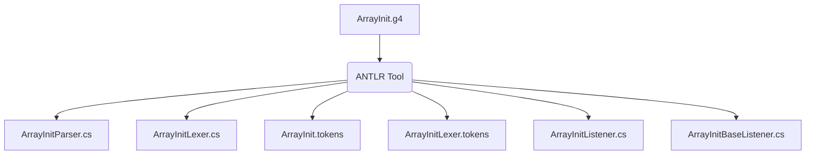

### 3.1. L'outil ANTLR, le Moteur d'Exécution et le Code Généré

Pour commencer, jetons un coup d'oeil dans le jar d'ANTLR. Il y a deux composants clés d'ANTLR : l'outil ANTLR lui-même et l'API d'exécution ANTLR (parse-time). Quand nous disons "exécuter ANTLR sur une grammaire", nous parlons d'exécuter l'outil ANTLR, classe `org.antlr.v4.Tool`. L'exécution d'ANTLR génère du code (un analyseur et un lexer) qui reconnaît les phrases dans le langage décrit par la grammaire. Un lexer décompose un flux d'entrée de caractères en jetons et les transmet à un analyseur syntaxique qui vérifie la syntaxe. Le runtime est une bibliothèque de classes et de méthodes nécessaires au code généré, comme le `Parser`, le `Lexer` et le `Token`. Nous exécutons d'abord ANTLR sur une grammaire, puis nous compilons le code généré en fonction des classes d'exécution contenues dans le jar. Finalement, l'application compilée s'exécute en conjonction avec les classes d'exécution.

La première étape de la construction d'une application linguistique consiste à créer une grammaire qui décrit les règles syntaxiques d'une langue (l'ensemble des phrases valides). Nous apprendrons à écrire des grammaires au [chapitre 5, Conception de grammaires](../../Chapter_05), mais pour l'instant, voici une grammaire qui fera ce que nous voulons :

https://github.com/Reefact/antlr4-book-examples/blob/a0cec2373ab284c311cd8d51d6e8502356dc3b84/Reefact.BookExamples.Antlr4/Chapter_03/.antlr/ArrayInit.g4#L1-L16

Nous pouvons exécuter ANTLR (l'outil) sur le fichier de grammaire

```bat
antlr4 ArrayInit.g4 -Dlanguage=CSharp
```

A partir de la grammaire `ArrayInit.g4`, ANTLR génère de nombreux fichiers que nous devrions normalement écrire à la main.



À ce stade, nous essayons simplement de comprendre l'essentiel du processus de développement. Voici donc une description rapide des fichiers générés:
