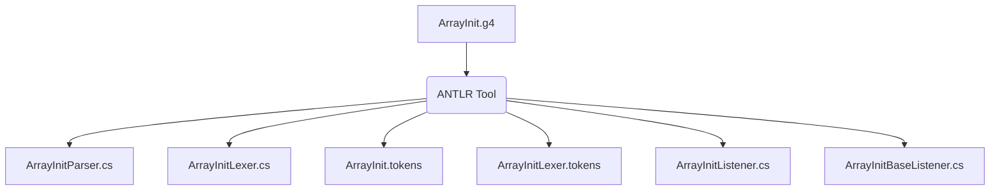

### 3.1. L'outil ANTLR, le Moteur d'Exécution et le Code Généré

Pour commencer, jetons un coup d'oeil dans le jar d'ANTLR. Il y a deux composants clés d'ANTLR : l'outil ANTLR lui-même et l'API d'exécution ANTLR (parse-time). Quand nous disons "exécuter ANTLR sur une grammaire", nous parlons d'exécuter l'outil ANTLR, classe `org.antlr.v4.Tool`. L'exécution d'ANTLR génère du code (un parser et un lexer) qui reconnaît les phrases dans le langage décrit par la grammaire. Un lexer décompose un flux d'entrée de caractères en jetons et les transmet à un parseur (aussi appelé analyseur syntaxique) qui vérifie la syntaxe. Le runtime est une bibliothèque de classes et de méthodes nécessaires au code généré, comme le `Parser`, le `Lexer` et le `Token`. Nous exécutons d'abord ANTLR sur une grammaire, puis nous compilons le code généré en fonction des classes d'exécution contenues dans le jar. Finalement, l'application compilée s'exécute en conjonction avec les classes d'exécution.

La première étape de la construction d'une application linguistique consiste à créer une grammaire qui décrit les règles syntaxiques d'une langue (l'ensemble des phrases valides). Nous apprendrons à écrire des grammaires au [chapitre 5, Conception de grammaires](../../Chapter_05), mais pour l'instant, voici une grammaire qui fera ce que nous voulons :

https://github.com/Reefact/antlr4-book-examples/blob/a0cec2373ab284c311cd8d51d6e8502356dc3b84/Reefact.BookExamples.Antlr4/Chapter_03/.antlr/ArrayInit.g4#L1-L16

Nous pouvons exécuter ANTLR (l'outil) sur le fichier de grammaire

```bat
antlr4 ArrayInit.g4 -Dlanguage=CSharp
```

A partir de la grammaire `ArrayInit.g4`, ANTLR génère de nombreux fichiers que nous devrions normalement écrire à la main.



À ce stade, nous essayons simplement de comprendre l'essentiel du processus de développement. Voici donc une description rapide des fichiers générés:

`ArrayInitParser.cs`

Ce fichier contient la définition de la classe de parser spécifique à la grammaire `ArrayInt` qui reconnaît notre syntaxe de langage de tableau.
```csharp
public partial class ArrayInitParser : Parser { ... }
```
Il contient une méthode pour chaque règle de la grammaire ainsi que du code de support.

`ArrayInitLexer.cs`

ANTLR extrait automatiquement une spécification de parser et de lexer séparée de notre grammaire. Ce fichier contient la définition de la classe du lexer, que ANTLR a générée en analysant les règles lexicales `INT` et `WS` ainsi que les littéraux de la grammaire '{', ',', et '}'. Rappelez-vous que le lexeur tokenise l'entrée, en la décomposant en symboles de vocabulaire. Voici les grandes lignes de la classe :
```csharp
public partial class ArrayInitLexer : Lexer { ... }
```

`Arrayinit. tokens`

ANTLR assigne un numéro de type de token à chaque token que nous définissons et stocke ces valeurs dans ce fichier. C'est nécessaire lorsque nous divisons une grande grammaire en plusieurs petites grammaires afin qu'ANTL puisse synchroniser tous les numéros de type de token (voir chapitre [4.1.1 Importation de grammaires](../../Chapter_04/1/1)).

`ArraylnitListener.cs`, `ArraylnitBaseListener.cs`

Par défaut, les parsers ANTLR construisent un arbre à partir de l'entrée. En parcourant cet arbre, un "tree walker" peut envoyer des événements (ou callbacks) à un objet listener que nous fournissons. `ArrayInitListener` est l'interface qui décrit les callbacks que nous pouvons implémenter. `ArrayInitBaseListener` est un ensemble d'implémentations par défaut vides. Cette classe nous permet de surcharger facilement les callbacks qui nous intéressent (voir Chapitre [7.2, Implémentation d'applications avec des Parse-Tree listener](../../Chapter_07/2)). ANTLR peut aussi générer pour nous des visiteurs d'arbres grâce à l'option de ligne de commande `-visitor` (voir chapitre [7.5.1. Traverser des arbres de parse avec des visiteurs](../../Chapter_07/5/1)).

Nous utiliserons bientôt les classes de listener pour traduire les initialisations de tableaux `short` en objets `string`, mais vérifions d'abord que notre analyseur syntaxique correspond correctement à un échantillon d'entrée.

| Les grammaires ANTLR sont plus fortes que les expressions régulières |
| --- |
| Ceux d'entre vous qui sont familiers avec les [expressions régulières](https://fr.wikipedia.org/wiki/Expression_r%C3%A9guli%C3%A8re) se demandent peut-être si ANTLR n'est pas un peu excessif pour un problème de reconnaissance aussi simple. Il s'avère que nous ne pouvons pas utiliser les expressions régulières pour reconnaître les initialisations à cause des initialisateurs imbriqués. Les expressions régulières n'ont pas de mémoire dans le sens où elles ne peuvent pas se souvenir de ce qu'elles ont fait correspondre précédemment dans l'entrée. De ce fait, elles ne savent pas comment faire correspondre les accolades gauche et droite. Nous y reviendrons plus en détail au chapitre [5.3.4 Pattern : Phrase imbriquée](../../Chapter_05/3/4). |

⏭ Chapitre suivant: [3.2. Test de l'Analyseur Généré](../2)
