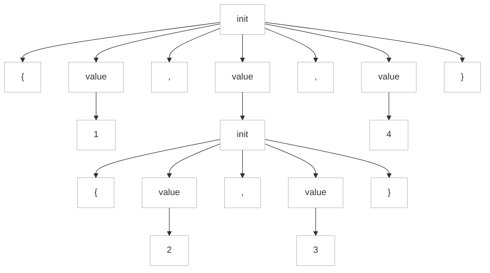

### 3.2. Test de l'analyseur généré

Commençons par tester notre grammaire en affichant les tokens créés par le lexer:

https://github.com/Reefact/antlr4-book-examples/blob/74bc453853afabbce220e53f0bbfef62e59087ba/Reefact.BookExamples.Antlr4/Chapter_03/2/Examples.cs#L19-L28
https://github.com/Reefact/antlr4-book-examples/blob/19746df081a5bb5e8119f2ed509e10dc0638e697/Reefact.BookExamples.Antlr4/Chapter_03/2/Examples.to_tokens_string.approved.txt

Contrairement à l'exemple du livre, nous n'avons pas besoin d'ajouter un saut de ligne pour confirmer la fin de fichier (EOF). Du coup un légère différence apparaît entre les deux exemples.

| Dans le livre | Dans notre exemple |
| [@7,13:12='<EOF>',<-1>,1:12] | [@7,12:11='<EOF>',<-1>,1:12] |

Par défaut, ANTLR charge l'entrée entière avant le traitement. C'est le cas le plus courant et le plus efficace. Chaque ligne de la sortie représente un seul jeton et montre tout ce que nous savons sur ce jeton. Par exemple `[@5,8:10=14511,<4>,1:8]` indique qu'il s'agit du jeton à l'index 5 (indexé à partir de 0), va des caractères en position 8 à 10 (inclusivement en partant de 0), a pour valeur (texte) 451, a le type de jeton 4 (INT), est sur la ligne 1 (à partir de 1), et est à la position de caractère 8 (en partant de zéro et en comptant les tabulations comme un seul caractère). Remarquez qu'il n'y a pas de jeton pour les caractères _espace_ et _nouvelle ligne_: la règle WS de notre grammaire les élimine à cause de la directive `->skip`.

Pour en savoir plus sur la façon dont l'analyseur a reconnu l'entrée, nous pouvons demander l'arbre d'analyse grâce à la méthode `ToLispStyleTree`.

https://github.com/Reefact/antlr4-book-examples/blob/74bc453853afabbce220e53f0bbfef62e59087ba/Reefact.BookExamples.Antlr4/Chapter_03/2/Examples.cs#L30-L39
```bat
(init { (value 99) , (value 3) , (value 451) })
```

Nous pouvons également utiliser la méthode `ToMermaidStyleTree` afin de pouvoir visualiser l'arbre:

https://github.com/Reefact/antlr4-book-examples/blob/74bc453853afabbce220e53f0bbfef62e59087ba/Reefact.BookExamples.Antlr4/Chapter_03/2/Examples.cs#L41-L51


