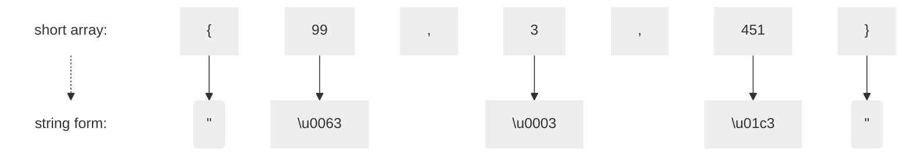

### 3.4. Création d'une application linguistique

En continuant avec notre exemple d'initialisateur de tableau, notre prochain objectif n'est plus seulement de reconnaître les initialisateurs mais aussi des les traduires. Par exemple, traduisons des tableaux de `short` Java comme `{99,3,451}` en `"\u0063\u0003\u01c3"` où 63 est la représentation hexadécimale de 99 en décimal.

Pour aller au-delà de la reconnaissance, une application doit extraire des données de l'arbre d'analyse syntaxique. La façon la plus simple de le faire est que le tree-walker intégré d'ANTLR déclenche une série de callbacks pendant qu'il effectue une marche en profondeur. Comme nous l'avons vu précédemment, ANTLR génère automatiquement une infrastructure de listeners pour nous. Ces listeners sont comme les callbacks sur les widgets de l'interface graphique (par exemple, un bouton nous notifie lorsqu'il est pressé) ou comme les événements SAX dans un parseur XML.

Pour écrire un programme qui réagit à l'entrée, tout ce que nous avons à faire est d'implémenter quelques méthodes dans une sous-classe de `ArrayInitBaseListener`. La stratégie de base consiste à faire en sorte que chaque méthode du listener traduise un morceau de l'entrée lorsque le tree-walker l'appelle.

La beauté du mécanisme des listeners est que nous n'avons pas besoin de parcourir l'arbre nous-mêmes. En fait, nous n'avons même pas besoin de savoir que le runtime parcourt un arbre pour appeler nos méthodes. Tout ce que nous savons, c'est que notre listener est notifié au début et à la fin des phrases associées aux règles de la grammaire.
Comme nous le verrons au chapitre [7.2. Implémentation d'applications avec des Parse-Tree listeners](../../Chapter_07/2), cette approche réduit les connaissances à acquérir sur ANTLR --nous sommes de retour en territoire familier de langage de programmation pour tout sauf la reconnaissance de phrases.

Débuter un projet de traduction consiste tout d'abord à trouver comment convertir chaque token ou phrase d'entrée en une chaîne de sortie. Pour ce faire, il est bon de traduire manuellement quelques échantillons représentatifs afin d'identifier les conversions générales de phrase à phrase. Dans ce cas, la traduction est assez simple.

En français, la traduction est une série de règles "X se transforme en Y".

1. Traduire { en ".
2. Traduire } en ".
3. Traduire des entiers en chaînes hexadécimales à quatre chiffres préfixées par \u.

Pour coder le traducteur, nous devons écrire des méthodes qui impriment les chaînes converties à la vue de la phrase ou de l'élément d'entrée approprié. Le tree-walker intégré déclenche des rappels dans un listener lorsqu'il voit le début et la fin des différentes phrases. Voici l'implémentation d'un listener pour nos règles de traduction :

https://github.com/Reefact/antlr4-book-examples/blob/fdea1cc1b98b86d9934d3cef95373a95113dcdac/Reefact.BookExamples.Antlr4/Chapter_03/4/ShortToUnicodeStringListener.cs#L12-L55

Nous n'avons pas besoin de surcharger chaque méthode d'entrée/sortie ; nous ne faisons que celles qui nous intéressent. La seule expression inconnue est `ctx.INT()`, qui demande à l'objet de contexte le jeton `INT` entier correspondant à cette invocation de valeur de règle. Les objets contextes enregistrent tout ce qui se passe pendant la reconnaissance d'une règle.

La seule chose qui reste à faire est de créer une application de traduction dérivée du code passe-partout du [GRun présenté au chapitre 3.2.](../2/GRun.cs). La seule différence est l'ajout des lignes suivantes:

https://github.com/Reefact/antlr4-book-examples/blob/b48e9550e0a5c314b8c1e287dfc8bdf7b059f1d6/Reefact.BookExamples.Antlr4/Chapter_03/4/GRun.cs#L33-L41

Le code crée le tree-walker et lui demande de parcourir l'arbre retourné par le parseur. Au fur et à mesure que le tree-walker se déplace, il déclenche des appels à notre listener `ShortToUnicodeString`.

Ci-dessous le code du test qui exécute notre traducteur sur un exemple:

https://github.com/Reefact/antlr4-book-examples/blob/b48e9550e0a5c314b8c1e287dfc8bdf7b059f1d6/Reefact.BookExamples.Antlr4/Chapter_03/4/Examples.cs#L18-L27

Ça marche ! Nous venons de construire notre premier traducteur, sans même toucher à la grammaire. Tout ce que nous avons eu à faire était d'implémenter quelques méthodes qui imprimaient les traductions des phrases appropriées. De plus, nous pouvons générer un résultat complètement différent simplement en passant dans un listener différent. Les listener isolent efficacement l'application linguistique de la grammaire, ce qui rend la grammaire réutilisable pour d'autres applications.
Dans le prochain chapitre, nous ferons un tour d'horizon de la notation de la grammaire ANTLR et des principales caractéristiques qui rendent ANTLR puissant et facile à utiliser.

⏭ Chapitre suivant: [4. Un tour rapide](../../Chapter_04)

