## 3. A Starter ANTLR Project

This example shows a basic grammar to start with.

_Remarks:_

_C# lexer and parser classes are generated with the following command line:_

```bat
antlr4 ArrayInit.g4 -Dlanguage=CSharp
```

Below, the parse trees generated by the examples:

##### ParseTree1


