#### 4.1.3. Handling Erroneous Input

This examples, based on the grammar of the previous chapter, shows how parsers handle erroneous input.

Below, the parse trees generated by the examples:

##### ParseTree1

