#### 4.4.2. Altering the Parse with Semantic Predicates

This example shows how to alter parsing using semantic predicates.

_Remarks:_

_C# lexer and parser classes are generated with the following command line:_

```bat
antlr4 -no-listener Data.g4 -Dlanguage=CSharp
```

Below, the parse trees generated by the examples:

##### ParseTree1

