### 5.3. Recognizing Common Language Patterns with ANTLR Grammars

This example shows one of the presented patterns, the Nested Phrase pattern which represents recursive description.

_Remarks:_

_C# lexer and parser classes are generated with the following command line:_

```bat
antlr4 NestedPhrasePattern.g4 -Dlanguage=CSharp
```

Below, the parse tree(s) generated by the example(s):

| a[1] | (a[1]) |
| ---- | ------ |
|  |  |
