### 5.4. Dealing with Precedence, Left Recursion, and Associativity

This example shows how to handle operator precedence and associativity direction for a simple calculator.

_Remarks:_

_C# lexer and parser classes are generated with the following command line:_

```bat
antlr4 -no-listener -visitor PLrA.g4 -Dlanguage=CSharp
```

Below, the parse tree(s) generated by the example(s):

| 1+2 | 1+2*3 | 
| --- | ----- | 
|  |  | 

| 1\*2\*3 | 1^2^3 |
| ----- | ----- |
|  |  |
