### 6.1. Parsing Comma-Separated Values

This example shows how to build a more complex comma-separated values parser as shown in previous chapter, handling header row and empty columns, ...

_Remarks:_

_C# lexer and parser classes are generated with the following command line:_

```bat
antlr4 CSV.g4 -Dlanguage=CSharp
```

Below, the parse trees generated by the examples:

##### ParseTree1

