### 6.2. Parsing JSON

This example shows how to build a real-world JSON grammar.

_Remarks:_

_C# lexer and parser classes are generated with the following command line:_

```bat
antlr4 JSON.g4 -Dlanguage=CSharp
```

##### ParseTree1

