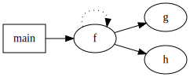

### 6.3. Parsing DOT

DOT is a declarative language for describing graphs such as network diagrams, trees, or state machines. This example shows how to build its grammar.

_Remarks:_

_C# lexer and parser classes are generated with the following command line:_

```bat
antlr4 DOT.g4 -Dlanguage=CSharp
```

Below, the parse tree(s) generated by the example(s):

##### ParseTree1


Below, the dot graph generated by the example(s). I used the [Graphviz extension](https://marketplace.visualstudio.com/items?itemName=joaompinto.vscode-graphviz) in Visual Studio Code to generate this image.

You can find more information about the DOT language and Graphviz viewer here: https://graphviz.org/

##### Dot Graph


