### 6.3. Parsing DOT

DOT is a declarative language for describing graphs such as network diagrams, trees, or state machines. This example shows how to build its grammar.

_Remarks:_

_C# lexer and parser classes are generated with the following command line:_

```bat
antlr4 DOT.g4 -Dlanguage=CSharp
```

##### ParseTree1

