### 6.4. Parsing Cymbol

Cymbol is a language that the author of the book invented to show a simple example of a non-object oriented language of type C.

_Remarks:_

_C# lexer and parser classes are generated with the following command line:_

```bat
antlr4 Cymbol.g4 -Dlanguage=CSharp
```

Below, the parse tree(s) generated by the example(s):

| t.cymbol |
| ---- |
|  |

| int a = -x+y; | float b = -a[i]; |
| ---- | ------ |
|  |  |
