### 6.5. Parsing R

This example shows how to build a grammar for the R language which is an expressive domain-specifc programming language for describing statistical problems.

_Remarks:_

_C# lexer and parser classes are generated with the following command line:_

```bat
antlr4 R.g4 -Dlanguage=CSharp
```

Below, the parse tree(s) generated by the example(s):

| t.R |
| --- |
|  |

| Ajay Shah b1 example |
| -------------------- |
|  | 

#### References

Below, updated links (2022-12-21) from the book.

9. [R yacc grammar](http://svn.r-project.org/R/trunk/src/main/gram.y)
10. [R language overview](.resouces/language-overview.pdf)
11. ~~[R language overview](http://www.stat.lsa.umich.edu/~kshedden/Courses/Stat600/Notes/R_introduction.pdf)~~ _[no more available]_
12. [Set of R examples from Ajay Shah website](https://www.mayin.org/ajayshah/KB/R/index.html)
13. [R project website](https://www.r-project.org/)
14. [R-intro](https://cran.r-project.org/doc/manuals/R-intro.pdf)
15. [R-lang](https://cran.r-project.org/doc/manuals/R-lang.html)