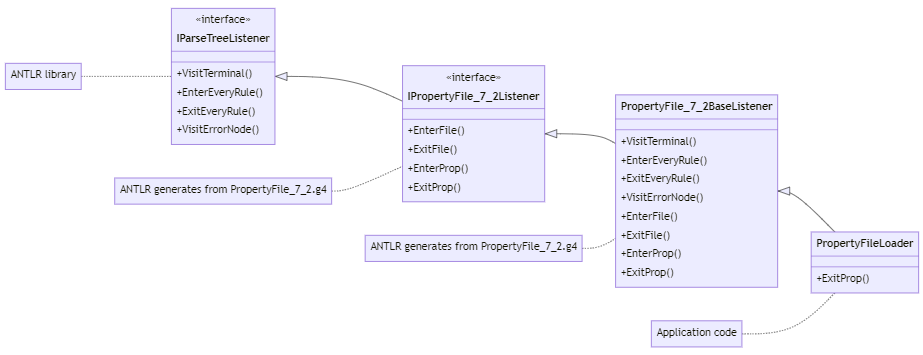

### 7.2. Implementing Applications with Parse-Tree Listeners

This example show how to override parse-tree listeners instead of parser to create a simple property file loader application.

_Remarks:_

_C# lexer and parser classes are generated with the following command line:_

```bat
antlr4 PropertyFile_7_2.g4 -Dlanguage=CSharp
```

Below, the parse tree(s) generated by the example(s):

| t.properties |
| ------------ |
|  |

And below the listener classes hierarchy :


