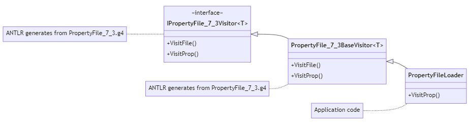

### 7.3. Implementing Applications with Visitors

This example show how to use visitors instead of parse-tree listeners to create a simple property file loader application.

_Remarks:_

_C# lexer and parser classes are generated with the following command line:_

```bat
antlr4 -no-listener -visitor PropertyFile_7_3.g4 -Dlanguage=CSharp
```

Below, the visitor classes hierarchy :


