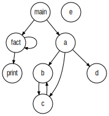

### 8.3. Generating a Call Graph

This example show how to generate a _call graph_ for Cymbol code. A _call graph_ allows to visualize the functions as nodes and function calls as directed edges between the nodes.

_Remarks:_

_C# lexer and parser classes are generated with the following command line:_

```bat
antlr4 Cymbol_8_3.g4 -Dlanguage=CSharp
```

Below, the call graph generated by the example(s). I used the [Graphviz extension](https://marketplace.visualstudio.com/items?itemName=joaompinto.vscode-graphviz) in Visual Studio Code to generate this image.

You can find more information about the DOT language and Graphviz viewer here: https://graphviz.org/

##### Call Graph


