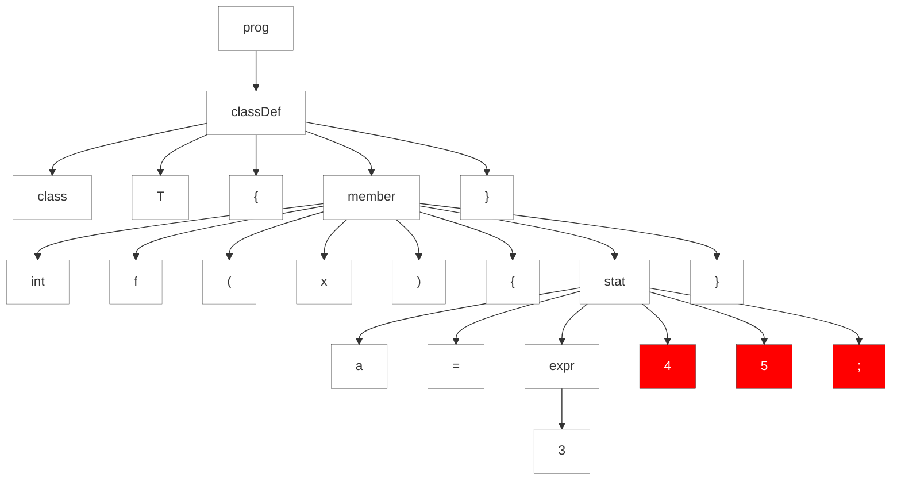

### 9.1. Une Parade aux Erreurs

La meilleure façon de décrire la stratégie de récupération des erreurs d'ANTLR est de regarder un analyseur généré par ANTLR répondre à une entrée erronée. Regardons une grammaire pour un langage simple de type Java contenant des définitions de classes avec des membres de champs et de méthodes. Les méthodes ont des déclarations et des expressions simples.

https://github.com/Reefact/antlr4-book-examples/blob/4688ca243c08b7695710b18e62012e5036c30496/Reefact.BookExamples.Antlr4/Chapter_09/1/.antlr/Simple.g4#L1-L32

Les actions intégrées impriment les éléments au fur et à mesure que le parseur les trouve. Nous utilisons des actions intégrées au lieu d'un listener d'arbre d'analyse pour des raisons de simplicité et de brièveté. Nous en apprendrons davantage sur les actions au chapitre [10. Attributs et actions](../../Chapter_10).

Tout d'abord, exécutons l'analyseur syntaxique avec une entrée valide pour observer la sortie normale.

```bat
antlr4 Simple.g4 -Dlanguage=CSharp
```
https://github.com/Reefact/antlr4-book-examples/blob/9db70397d6598117e19655acacc0bc648093db43/Reefact.BookExamples.Antlr4/Chapter_09/1/GRun.cs#L12-L42
https://github.com/Reefact/antlr4-book-examples/blob/4688ca243c08b7695710b18e62012e5036c30496/Reefact.BookExamples.Antlr4/Chapter_09/1/Examples.cs#L21-L30

Nous n'obtenons aucune erreur de l'analyseur syntaxique, et il exécute les instructions d'impression pour signaler la reconnaissance correcte de la variable `i` et de la définition de classe `T`.

Maintenant, essayons une classe avec une définition de méthode contenant une fausse expression d'affectation.

https://github.com/Reefact/antlr4-book-examples/blob/a90511a306d5ab4a19f18ef03d1985831671fdc8/Reefact.BookExamples.Antlr4/Chapter_09/1/.resources/single_extra_token.simple#L1
https://github.com/Reefact/antlr4-book-examples/blob/4688ca243c08b7695710b18e62012e5036c30496/Reefact.BookExamples.Antlr4/Chapter_09/1/Examples.cs#L55-L64
https://github.com/Reefact/antlr4-book-examples/blob/4688ca243c08b7695710b18e62012e5036c30496/Reefact.BookExamples.Antlr4/Chapter_09/1/Examples.printing_elements_in_a_bogus_assignment_expression.approved.txt#L1-L3

Au token 4, l'analyseur ne trouve pas le `;` qu'il attendait et signale une erreur. La ligne 2:18 indique que le token en question a été trouvé sur la deuxième ligne à la dix-neuvième position de caractère (les positions de caractère commencent à partir de zéro).

Grâce à l'option d'impression sous forme d'arbre `ToMermaidStyleTree()`, nous voyons également l'arbre d'analyse avec les noeuds d'erreur mis en évidence (nous y reviendrons dans un instant).

https://github.com/Reefact/antlr4-book-examples/blob/b998242b8ddd91a9f85da0b2b7d925884cdf7ea8/Reefact.BookExamples.Antlr4/Chapter_09/1/.resources/bogus_assignment_expression.simple#L1-L3
https://github.com/Reefact/antlr4-book-examples/blob/3e351981b6f338b099d406dc4de488994090f35d/Reefact.BookExamples.Antlr4/Chapter_09/1/Examples.cs#L43-L53


Below, the parse tree(s) generated by the example(s):

| bogus_assignment_expression.simple | single_extra_token.simple | single_token_insertion.simple |
| ---------------------------------- | ------------------------- | ----------------------------- |
|  |  |  |
