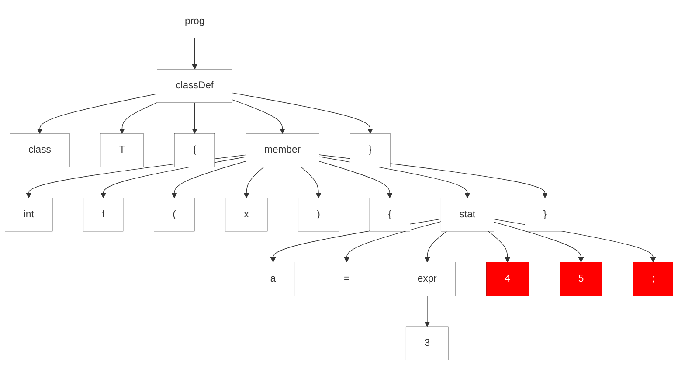
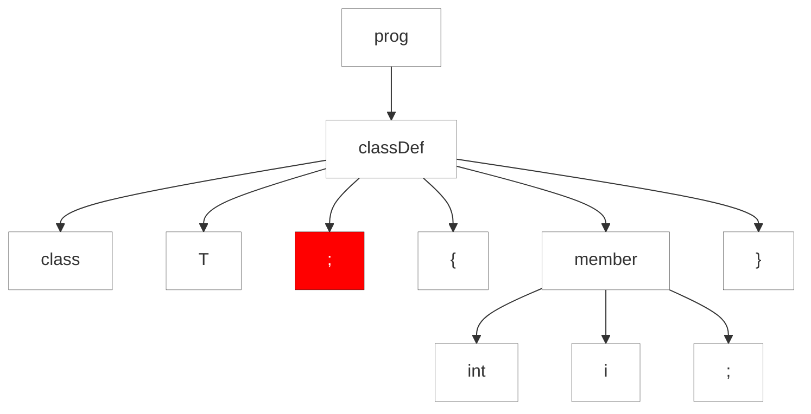
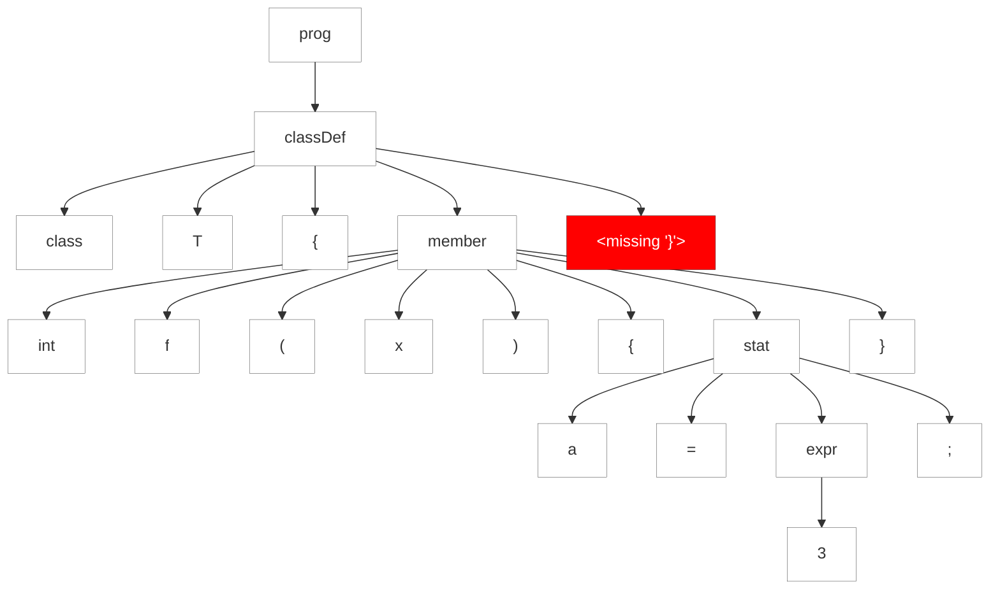

### 9.1. Une Parade aux Erreurs

La meilleure façon de décrire la stratégie de récupération des erreurs d'ANTLR est de regarder un parser généré par ANTLR répondre à une entrée erronée. Regardons une grammaire pour un langage simple de type Java contenant des définitions de classes avec des membres de champs et de méthodes. Les méthodes ont des déclarations et des expressions simples.

https://github.com/Reefact/antlr4-book-examples/blob/4688ca243c08b7695710b18e62012e5036c30496/Reefact.BookExamples.Antlr4/Chapter_09/1/.antlr/Simple.g4#L1-L32

Les actions intégrées impriment les éléments au fur et à mesure que le parseur les trouve. Nous utilisons des actions intégrées au lieu d'un listener d'arbre d'analyse pour des raisons de simplicité et de brièveté. Nous en apprendrons davantage sur les actions au chapitre [10. Attributs et actions](../../Chapter_10).

Tout d'abord, exécutons l'analyseur syntaxique avec une entrée valide pour observer la sortie normale.

```bat
antlr4 Simple.g4 -Dlanguage=CSharp
```
https://github.com/Reefact/antlr4-book-examples/blob/9db70397d6598117e19655acacc0bc648093db43/Reefact.BookExamples.Antlr4/Chapter_09/1/GRun.cs#L12-L42
https://github.com/Reefact/antlr4-book-examples/blob/4688ca243c08b7695710b18e62012e5036c30496/Reefact.BookExamples.Antlr4/Chapter_09/1/Examples.cs#L21-L30

Nous n'obtenons aucune erreur de l'analyseur syntaxique, et il exécute les instructions d'impression pour signaler la reconnaissance correcte de la variable `i` et de la définition de classe `T`.

Maintenant, essayons une classe avec une définition de méthode contenant une fausse expression d'affectation.

https://github.com/Reefact/antlr4-book-examples/blob/a90511a306d5ab4a19f18ef03d1985831671fdc8/Reefact.BookExamples.Antlr4/Chapter_09/1/.resources/single_extra_token.simple#L1
https://github.com/Reefact/antlr4-book-examples/blob/4688ca243c08b7695710b18e62012e5036c30496/Reefact.BookExamples.Antlr4/Chapter_09/1/Examples.cs#L55-L64
https://github.com/Reefact/antlr4-book-examples/blob/4688ca243c08b7695710b18e62012e5036c30496/Reefact.BookExamples.Antlr4/Chapter_09/1/Examples.printing_elements_in_a_bogus_assignment_expression.approved.txt#L1-L3

Au token 4, l'analyseur ne trouve pas le `;` qu'il attendait et signale une erreur. La ligne 2:18 indique que le token en question a été trouvé sur la deuxième ligne à la dix-neuvième position de caractère (les positions de caractère commencent à partir de zéro).

Grâce à l'option d'impression sous forme d'arbre `ToMermaidStyleTree()`, nous voyons également l'arbre d'analyse avec les noeuds d'erreur mis en évidence (nous y reviendrons dans un instant).

https://github.com/Reefact/antlr4-book-examples/blob/b998242b8ddd91a9f85da0b2b7d925884cdf7ea8/Reefact.BookExamples.Antlr4/Chapter_09/1/.resources/bogus_assignment_expression.simple#L1-L3
https://github.com/Reefact/antlr4-book-examples/blob/3e351981b6f338b099d406dc4de488994090f35d/Reefact.BookExamples.Antlr4/Chapter_09/1/Examples.cs#L43-L53


Dans ce cas, il y a deux tokens supplémentaires, et l'analyseur syntaxique affiche un message d'erreur générique sur la non-concordance. Cependant, s'il n'y a qu'un seul token supplémentaire, le parser peut être un peu plus intelligent, en indiquant qu'il s'agit d'un token étranger. Dans le test suivant, il y a un `:` après le nom de la classe et avant le début du corps de la classe :

https://github.com/Reefact/antlr4-book-examples/blob/63f20db15006716982001ef52e14ffcdeedcfe62/Reefact.BookExamples.Antlr4/Chapter_09/1/.resources/single_extra_token.simple#L1
https://github.com/Reefact/antlr4-book-examples/blob/63f20db15006716982001ef52e14ffcdeedcfe62/Reefact.BookExamples.Antlr4/Chapter_09/1/Examples.cs#L55-L64
https://github.com/Reefact/antlr4-book-examples/blob/63f20db15006716982001ef52e14ffcdeedcfe62/Reefact.BookExamples.Antlr4/Chapter_09/1/Examples.printing_elements_when_error_consists_of_a_single_extra_token.approved.txt#L1-L3


L'analyseur syntaxique signale une erreur au niveau de `;` mais donne une réponse légèrement plus informative parce qu'il sait que le token suivant est ce qu'il recherchait réellement. Cette fonction est appelée suppression d'un seul token, car le parser peut simplement prétendre que le token étranger n'est pas là et continuer. De même, le parser peut effectuer une insertion single-token lorsqu'il détecte un token manquant. Retirons l'accolade de fermeture pour voir ce qui se passe.

https://github.com/Reefact/antlr4-book-examples/blob/068a2dcfe1e3b7bd34f747dede5ac79cfb8653c8/Reefact.BookExamples.Antlr4/Chapter_09/1/.resources/single_token_insertion.simple#L1-L2
https://github.com/Reefact/antlr4-book-examples/blob/068a2dcfe1e3b7bd34f747dede5ac79cfb8653c8/Reefact.BookExamples.Antlr4/Chapter_09/1/Examples.cs#L78-L90
https://github.com/Reefact/antlr4-book-examples/blob/068a2dcfe1e3b7bd34f747dede5ac79cfb8653c8/Reefact.BookExamples.Antlr4/Chapter_09/1/Examples.printing_elements_when_parser_can_do_single_token_insertion.approved.txt#L1-L4


L'analyseur syntaxique signale qu'il n'a pas pu trouver le token `}` attendu.

Une autre erreur de syntaxe courante se produit lorsque le parser se trouve à un point de décision et que l'entrée restante ne correspond à aucune des alternatives de cette règle ou sous-règle. Par exemple, si nous oublions le nom de la variable dans une déclaration de champ, aucune des alternatives de la règle membre ne correspondra. L'analyseur syntaxique signale qu'il n'y a pas d'alternative viable.

https://github.com/Reefact/antlr4-book-examples/blob/cd33bbfbceb5f223bac1d676588d7ca874be29b7/Reefact.BookExamples.Antlr4/Chapter_09/1/Examples.cs#L104-L113
https://github.com/Reefact/antlr4-book-examples/blob/cd33bbfbceb5f223bac1d676588d7ca874be29b7/Reefact.BookExamples.Antlr4/Chapter_09/1/Examples.printing_elements_when_no_viable_alternative.approved.txt#L1-L2

Il n'y a pas d'espace entre `int` et `;` parce que nous avons dit au lexer de `->skip` dans la règle `WS` qui gère les espacements.
En cas d'erreurs lexicales, ANTLR émet également un message d'erreur indiquant le ou les caractères qu'il n'a pas pu reconnaître comme faisant partie d'un token. Par exemple, si nous envoyons un caractère complètement inconnu, nous obtenons une erreur de reconnaissance de token erreur.

https://github.com/Reefact/antlr4-book-examples/blob/cd33bbfbceb5f223bac1d676588d7ca874be29b7/Reefact.BookExamples.Antlr4/Chapter_09/1/Examples.cs#L115-L124
https://github.com/Reefact/antlr4-book-examples/blob/cd33bbfbceb5f223bac1d676588d7ca874be29b7/Reefact.BookExamples.Antlr4/Chapter_09/1/Examples.printing_elements_when_lexical_error.approved.txt#L1-L4

Puisque nous n'avons pas donné de nom de classe valide, le mécanisme d'insertion d'un seul jeton a fait apparaître le nom `missing ID` afin que le jeton de nom de classe soit non-nul. Pour prendre le contrôle de la façon dont l'analyseur syntaxique conjure les jetons, remplacez `getMissingSymbol()` dans `DefaultErrorStrategy` (voir chapitre [9.5. Modifier la stratégie de gestion des erreurs d'ANTLR](../5)).

Vous avez peut-être remarqué que les exemples d'exécution de cette section montrent que les actions s'exécutent comme prévu, malgré la présence d'erreurs. En plus de produire de bons messages d'erreur et de resynchroniser l'entrée en consommant des tokens, les analyseurs syntaxiques doivent également rebondir à un endroit approprié dans le code généré.

Par exemple, lors de la mise en correspondance de membres via la règle `member` dans la règle `classDef`, l'analyseur syntaxique ne doit pas sortir de `classDef` en cas de mauvaise définition de membre. C'est pourquoi le parser est toujours capable d'exécuter ces actions -- une erreur de syntaxe ne fait pas sortir le parser de la règle. Le parser fait de gros efforts pour continuer à chercher une définition de classe valide. Nous apprendrons tout sur ce sujet dans le chapitre [9.3. Stratégie de récupération automatique des erreurs](../3). Mais d'abord, voyons comment modifier le rapport d'erreur standard pour faciliter le débogage de la grammaire et fournir de meilleurs messages à nos utilisateurs.

⏭ Chapitre suivant: [9.2. Modifier et Rediriger les Messages d'Erreur ANTLR](../2)
