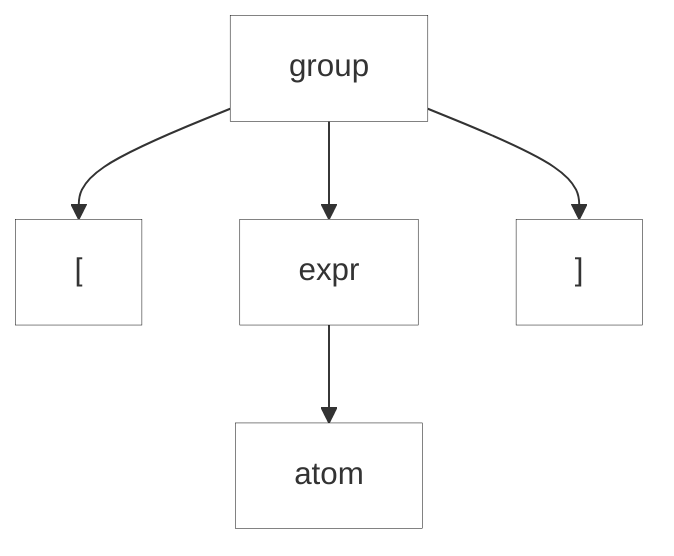

#### 9.3.1. Récupération en Recherchant les Jetons Suivants

Lorsque l'analyseur est confronté à une entrée vraiment abîmée, la règle actuelle ne peut pas continuer, donc l'analyseur récupère en avalant des tokens jusqu'à ce qu'il pense avoir resynchronisé et retourne à la règle appelante. On peut appeler cela la stratégie "sync-and-return". Certains l'appellent "mode panique", mais elle fonctionne remarquablement bien. L'analyseur sait qu'il ne peut pas faire correspondre l'entrée actuelle avec la règle actuelle. Il ne peut jeter des jetons que jusqu'à ce que le lookahead soit cohérent avec quelque chose qui devrait correspondre après la sortie de l'analyseur de la règle. Par exemple, s'il y a une erreur de syntaxe dans une instruction d'affectation, il est très logique de rejeter les jetons jusqu'à ce que l'analyseur voit un point-virgule ou un autre terminateur d'instruction. Drastique, mais efficace. Comme nous le verrons, ANTLR essaie de récupérer dans la règle avant de se rabattre sur cette stratégie de base.

Chaque méthode de règle générée par ANTLR est enveloppée dans un try-catch qui répond aux erreurs de syntaxe en signalant l'erreur et en essayant de récupérer avant de retourner.

```csharp
try {
    ...
} catch(RecognitionException re) {
    ErrorHandler.ReportError(this, re);
    ErrorHandler.Recover(this, re);
}
```

Nous examinerons la stratégie de gestion des erreurs plus en détail au chapitre [9.5. Modifier la stratégie de gestion des erreurs d'ANTLR](../../5/ReadMe.md), mais, pour l'instant, nous pouvons résumer la méthode _ErrorHandler.Recover()_ comme consommant des jetons jusqu'à ce qu'il en trouve un dans l'_ensemble de resynchronisation_.
L'ensemble de resynchronisation est l'union des _ensembles de suivi_ des références de règles pour toutes les règles de la pile d'invocation. L'ensemble de suivi d'une référence de règle est l'ensemble des jetons qui peuvent correspondre immédiatement après cette référence et sans quitter la règle actuelle. Ainsi, par exemple, étant donné l'alternative _assign_ ';', l'ensemble suivant pour la référence de règle _assign_ est {';'}.

Il est utile de passer par un exemple pour verrouiller ce que contiennent les ensembles de resynchronisation. Considérons la grammaire suivante, et imaginons qu'à chaque invocation de règle, l'analyseur syntaxique suive l'ensemble suivant pour chaque invocation de règle:

https://github.com/Reefact/antlr4-book-examples/blob/12664a0d317a3cebb9667926e4c8c85f06ac7eb7/Reefact.BookExamples.Antlr4/Chapter_09/3/1/.antlr/F.g4?plain=1#L1-L13

```bat
antlr4 F.g4 -Dlanguage=CSharp
```

Considérons l'arbre d'analyse à gauche pour l'entrée \[1^2\] dans le diagramme suivant :

| Good syntax: \[1^2\] | Bad syntax: \[\] |
| ----------- | ---------- |
|  |  |



En faisant correspondre le token 1 à la règle atom, la pile d'appels est \[_group_, _expr_, _atom_\] (_group_ a appelé _expr_, qui a appelé _atom_). En regardant la pile d'appels, nous connaissons précisément l'ensemble des tokens qui peuvent suivre chaque règle que l'analyseur a appelée pour nous amener à la position actuelle. Les ensembles qui suivent ne prennent en compte que les tokens de la règle actuelle, de sorte qu'au moment de l'exécution, nous pouvons combiner uniquement les ensembles associés à la pile d'appels actuelle. En d'autres termes, nous ne pouvons pas atteindre la règle expr à partir des deux alternatives de groupe en même temps.
En combinant les ensembles suivants tirés des commentaires de la grammaire F, nous obtenons un ensemble de resynchronisation de {'^', '\]'}. Pour voir pourquoi c'est l'ensemble que nous voulons, observons ce qui se passe lorsque l'analyseur rencontre une entrée erronée \[\]. Nous obtenons l'arbre d'analyse syntaxique montré à droite dans le diagramme côte à côte précédent. Dans atom, l'analyseur découvre que le token actuel, \], n'est pas compatible avec l'une ou l'autre des alternatives de atom.
