#### 9.3.1. Recovery by Scanning for Following Tokens

This example show how errors can be handled by custom errors listener.

_Remarks:_

_C# lexer and parser classes are generated with the following command line:_

```bat
antlr4 F.g4 -Dlanguage=CSharp
```

Below, the parse tree(s) generated by the example(s):

| Good syntax | Bad syntax |
| ----------- | ---------- |
|  |  |