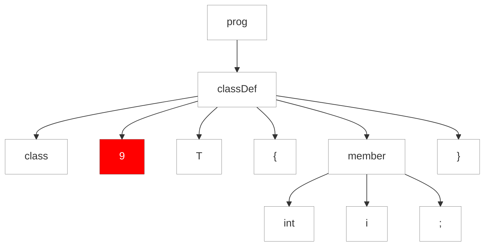

#### 9.3.2. Récupération à Partir de Jetons Non Concordants

L'une des opérations les plus courantes lors de l'analyse syntaxique est "match token". Pour chaque référence de token, `T`, dans la grammaire, l'analyseur syntaxique invoque `match(T)`. Si le token actuel n'est pas `T`, `match()` notifie les listeners d'erreur et tente de se resynchroniser. Pour se resynchroniser, il a trois choix. Il peut soit supprimer un jeton, soit il peut en faire apparaître un, soit il peut lancer une exception pour engager le mécanisme de synchronisation et de retour de base.

La suppression du jeton actuel est le moyen le plus simple de resynchroniser, si cela a un sens. Revoyons la règle `classDef` de notre langage de définition de classe dans la grammaire `Simple`.

https://github.com/Reefact/antlr4-book-examples/blob/50f1e91c0c7061d62119799b4e2e867f3e4f0999/Reefact.BookExamples.Antlr4/Chapter_09/1/.antlr/Simple.g4#L10-L12

Étant donné la classe d'entrée `9 T { int i ; }`, l'analyseur syntaxique supprimera 9 et continuera dans la règle pour correspondre au corps de la classe. L'image suivante illustre l'état de l'entrée après que l'analyseur syntaxique ait consommé la classe :

// TODO: see how to add graph

Les étiquettes `LA(1)` et `LA(2)` marquent le premier token de lookahead (le token actuel) et le second token de lookahead. Le `match(ID)` s'attend à ce que `LA(1)` soit un `ID`, mais ce n'est pas le cas. Cependant, le jeton suivant, `LA(2)`, est en fait un `ID`. Pour récupérer, il suffit de supprimer le jeton actuel (en tant que bruit), de consommer l'`ID` que nous attendions, et de quitter `match()`.

Le code suivant nous montre comment cette entrée est considérée par le parser:

https://github.com/Reefact/antlr4-book-examples/blob/eebe6d24e42572c7c85786beee0ad3ca4234fe24/Reefact.BookExamples.Antlr4/Chapter_09/3/2/Examples.cs#L19-L39
https://github.com/Reefact/antlr4-book-examples/blob/eebe6d24e42572c7c85786beee0ad3ca4234fe24/Reefact.BookExamples.Antlr4/Chapter_09/3/2/Examples.extraneous_input_9_lisp_style_tree.approved.txt#L1-L2

Si le parser ne peut pas se resynchroniser en supprimant un jeton, il tente d'insérer un jeton à la place. Disons que nous avons oublié l'`ID` pour que `classDef` voie l'entrée `class { int i ; 3`. Après avoir fait correspondre la classe, l'état de l'entrée ressemble à ceci :
