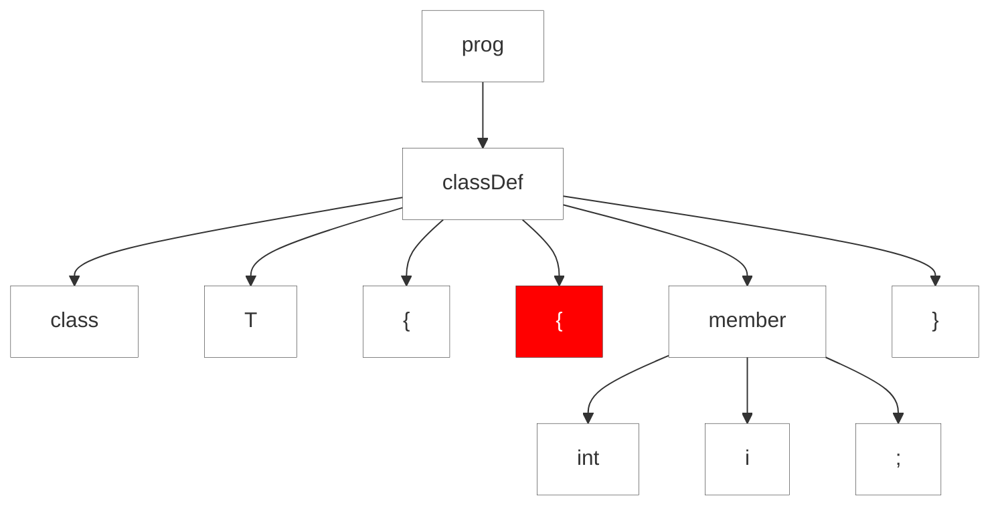

#### 9.3.3. Récupération d'Erreurs Dans les Sous-Règles

Il y a quelques années, le groupe JavaFX de Sun m'a contacté parce que leur parseur généré via ANTLRgenerated ne se rétablissait pas bien dans certains cas. Il s'est avéré que l'analyseur syntaxique sortait des boucles de sous-règles comme `member+` au premier signe de problème, forçant la récupération sync-and-return pour la règle englobante. Une petite erreur dans une déclaration de membre comme `var width Number ;` (il manque un deux-points après `width`) forcerait l'analyseur à sauter tous les membres restants.

Jim Idle, un contributeur à la liste de diffusion ANTLR et consultant, a mis au point ce que j'appelle la récupération d'erreur "Jim Idle's magic sync". Sa solution était d'insérer manuellement des références à une règle vide dans la grammaire qui contenait une action spéciale qui déclenchait la récupération d'erreur lorsque nécessaire. ANTLR v4 insère maintenant automatiquement des vérifications de synchronisation au début et à la suite du test de la boucle pour éviter une telle récupération drastique. Le mécanisme ressemble à ceci :

- _Début de sous-règle_:  Au début de toute sous-règle, les analyseurs syntaxiques tentent la suppression d'un seul token.
simple. Mais, contrairement aux correspondances de tokens, les analyseurs syntaxiques ne tentent pas l'insertion de tokens uniques. ANTLR aurait du mal à faire apparaître un token car il devrait deviner laquelle de plusieurs alternatives serait finalement réussie.
- _Test de continuation de sous-règle en boucle_:  Si la sous-règle est une construction en boucle, `(..)*` ou `(.)+`, l'analyseur syntaxique essaie de récupérer agressivement l'erreur pour rester dans la boucle. Après avoir réussi à faire correspondre une alternative de la boucle, l'analyseur consomme jusqu'à ce qu'il trouve un token cohérent avec l'un de ces ensembles :
	(a) Une autre itération de la boucle
	(b) Ce qui suit la boucle
	(c) L'ensemble de resynchronisation du courant 
	
Examinons d'abord la suppression d'un seul jeton devant une sous-règle. Considérons la construction `membre+` en boucle dans la règle `classDef` de la grammaire Simple. Si nous bégayons et tapons un `(` supplémentaire, la sous-règle `member+` supprimera le token supplémentaire avant de passer à `member`, comme le montre l'arbre d'analyse suivant :

https://github.com/Reefact/antlr4-book-examples/blob/b73a4316662e27068ee68dade49459fe0d11d4c4/Reefact.BookExamples.Antlr4/Chapter_09/3/3/Examples.cs#L17-L28

La session suivante confirme la récupération correcte car elle identifie correctement la variable `i` :

https://github.com/Reefact/antlr4-book-examples/blob/b73a4316662e27068ee68dade49459fe0d11d4c4/Reefact.BookExamples.Antlr4/Chapter_09/3/3/Examples.cs#L30-L39
https://github.com/Reefact/antlr4-book-examples/blob/b73a4316662e27068ee68dade49459fe0d11d4c4/Reefact.BookExamples.Antlr4/Chapter_09/3/3/Examples.single_token_deletion_output.approved.txt#L1-L3

// to be continued...
