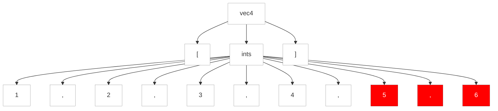

#### 9.3.4. Rattraper les Prédicats Sémantiques Ratés

Nous n'avons eu qu'un aperçu des prédicats sémantiques à ce stade, mais il est approprié de discuter de ce qui se passe lorsque des prédicats échouent dans ce chapitre lié à la gestion des erreurs. Nous examinerons les prédicats en profondeur au chapitre [11. Modifier l'analyse avec les prédicats sémantiques](../../../Chapter_10). Pour l'instant, traitons les prédicats sémantiques comme des assertions. Ils spécifient des conditions qui doivent être vraies au moment de l'exécution pour que l'analyseur syntaxique puisse les dépasser. Si un prédicat est évalué à faux, l'analyseur syntaxique lance une exception `FailedPredicateException`, qui est rattrapée par le catch de la règle actuelle. L'analyseur syntaxique signale une erreur et effectue la récupération générique sync-and-return.

Examinons un exemple qui utilise un prédicat sémantique pour restreindre le nombre d'entiers dans un vecteur, très similaire à la grammaire au chapitre [4.4.2 Modifier l'Analyse Avec des Prédicats Sémantiques]. La règle `ints` correspond au `max` des entiers.

https://github.com/Reefact/antlr4-book-examples/blob/e666e447a1937fd54dfdd82cf8a7f6d145d0de1c/Reefact.BookExamples.Antlr4/Chapter_09/3/4/.antlr/Vec.g4#L1-L9

Etant donné une entrée avec trop d'entiers, comme dans l'exemple suivant, nous voyons un message d'erreur et obtenons une récupération d'erreur qui élimine la virgule et les entiers supplémentaires :

```bat
antlr4 Vec.g4 -Dlanguage=CSharp
```
https://github.com/Reefact/antlr4-book-examples/blob/e666e447a1937fd54dfdd82cf8a7f6d145d0de1c/Reefact.BookExamples.Antlr4/Chapter_09/3/4/Examples.cs#L17-L26
https://github.com/Reefact/antlr4-book-examples/blob/e666e447a1937fd54dfdd82cf8a7f6d145d0de1c/Reefact.BookExamples.Antlr4/Chapter_09/3/4/Examples.vec_lisp_style_tree.approved.txt#L1-L2

L'arbre d'analyse montre que le parser a détecté l'erreur au cinquième entier.

https://github.com/Reefact/antlr4-book-examples/blob/e666e447a1937fd54dfdd82cf8a7f6d145d0de1c/Reefact.BookExamples.Antlr4/Chapter_09/3/4/Examples.cs#L28-L37


Le message d'erreur `{$i<=$max}` peut nous être utile en tant que concepteurs de grammaires, mais il ne l'est certainement pas pour nos utilisateurs. Nous pouvons changer le message d'un morceau de code en quelque chose d'un peu plus lisible en utilisant l'option `fail` sur le prédicat sémantique. Par exemple, voici à nouveau la règle `ints`, mais avec une action qui calcule une chaîne lisible :


// to be continued
