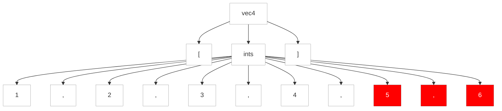

#### 9.3.4. Rattraper les Prédicats Sémantiques Ratés

Nous n'avons eu qu'un aperçu des prédicats sémantiques à ce stade, mais il est approprié de discuter de ce qui se passe lorsque des prédicats échouent dans ce chapitre lié à la gestion des erreurs. Nous examinerons les prédicats en profondeur au chapitre [11. Modifier l'analyse avec les prédicats sémantiques](../../../Chapter_10). Pour l'instant, traitons les prédicats sémantiques comme des assertions. Ils spécifient des conditions qui doivent être vraies au moment de l'exécution pour que l'analyseur syntaxique puisse les dépasser. Si un prédicat est évalué à faux, l'analyseur syntaxique lance une exception `FailedPredicateException`, qui est rattrapée par le catch de la règle actuelle. L'analyseur syntaxique signale une erreur et effectue la récupération générique sync-and-return.

Examinons un exemple qui utilise un prédicat sémantique pour restreindre le nombre d'entiers dans un vecteur, très similaire à la grammaire au chapitre [4.4.2 Modifier l'Analyse Avec des Prédicats Sémantiques](../../../Chapter_04/4/2). La règle `ints` correspond au `max` des entiers.

https://github.com/Reefact/antlr4-book-examples/blob/e666e447a1937fd54dfdd82cf8a7f6d145d0de1c/Reefact.BookExamples.Antlr4/Chapter_09/3/4/.antlr/Vec.g4#L1-L9

Etant donné une entrée avec trop d'entiers, comme dans l'exemple suivant, nous voyons un message d'erreur et obtenons une récupération d'erreur qui élimine la virgule et les entiers supplémentaires :

```bat
antlr4 Vec.g4 -Dlanguage=CSharp
```
https://github.com/Reefact/antlr4-book-examples/blob/e666e447a1937fd54dfdd82cf8a7f6d145d0de1c/Reefact.BookExamples.Antlr4/Chapter_09/3/4/Examples.cs#L17-L26
https://github.com/Reefact/antlr4-book-examples/blob/e666e447a1937fd54dfdd82cf8a7f6d145d0de1c/Reefact.BookExamples.Antlr4/Chapter_09/3/4/Examples.vec_lisp_style_tree.approved.txt#L1-L2

L'arbre d'analyse montre que le parser a détecté l'erreur au cinquième entier.

https://github.com/Reefact/antlr4-book-examples/blob/e666e447a1937fd54dfdd82cf8a7f6d145d0de1c/Reefact.BookExamples.Antlr4/Chapter_09/3/4/Examples.cs#L28-L37


Le message d'erreur `{$i<=$max}` peut nous être utile en tant que concepteurs de grammaires, mais il ne l'est certainement pas pour nos utilisateurs. Nous pouvons changer le message d'un morceau de code en quelque chose d'un peu plus lisible en utilisant l'option `fail` sur le prédicat sémantique. Par exemple, voici à nouveau la règle `ints`, mais avec une action qui calcule une chaîne lisible :

https://github.com/Reefact/antlr4-book-examples/blob/21599e580c88d5f3022f0bbb6f33cee8bcfe540a/Reefact.BookExamples.Antlr4/Chapter_09/3/4/.antlr/VecMsg.g4#L1-L9

Maintenant, nous obtenons un meilleur message pour la même entrée.

```bat
antlr4 VecMsg.g4 -Dlanguage=CSharp
```
https://github.com/Reefact/antlr4-book-examples/blob/21599e580c88d5f3022f0bbb6f33cee8bcfe540a/Reefact.BookExamples.Antlr4/Chapter_09/3/4/Examples.cs#L39-L48
https://github.com/Reefact/antlr4-book-examples/blob/21599e580c88d5f3022f0bbb6f33cee8bcfe540a/Reefact.BookExamples.Antlr4/Chapter_09/3/4/Examples.vec_msg_lisp_style_tree.approved.txt#L1-L2

L'option `fail` prend soit un littéral de chaîne entre guillemets simples, soit une action qui évalue une chaîne. L'action est pratique si vous souhaitez exécuter une fonction lorsqu'un prédicat échoue. Il suffit d'utiliser une action qui appelle une fonction telle que `{...}?<fail={failedMaxTest()}>`.

Un mot d'avertissement sur l'utilisation des prédicats sémantiques pour tester la validité des entrées. Dans l'exemple du vecteur, le prédicat applique des règles syntaxiques, il est donc normal de lever une exception et d'essayer de récupérer. Si, par contre, nous avons une construction syntaxiquement valide mais sémantiquement invalide, ce n'est pas une bonne idée d'utiliser un prédicat sémantique.

Imaginez que, dans un certain langage, nous pouvons attribuer n'importe quelle valeur à une variable, sauf 0. Cela signifie que l'affectation `x = 0;` est syntaxiquement valide mais sémantiquement invalide. Nous devons certainement émettre une erreur à l'intention de l'utilisateur, mais nous ne devons pas déclencher la récupération de l'erreur. `x = 0;` est parfaitement légal d'un point de vue syntaxique. En un sens, l'analyseur syntaxique se "remet" automatiquement de l'erreur. Voici une grammaire simple qui illustre le problème.

```
assign	:	ID '=' v=INT {$v.int>0}? ';'
		{ Console.WriteLine("assign "+$ID.Text+" to "); }
		;
```

Si le prédicat de la règle `assign` lève une exception, le comportement sync-and-return rejettera le `;` après le prédicat. Cela pourrait fonctionner parfaitement, mais nous risquons une resynchronisation imparfaite. Une meilleure solution consiste à émettre une erreur manuellement et à laisser l'analyseur syntaxique continuer à faire correspondre la syntaxe correcte. Donc, au lieu du prédicat, nous devrions utiliser une action simple avec un condition. 

https://github.com/Reefact/antlr4-book-examples/blob/9e81e255dbaf56b1332c09c52c3144465f84ecb7/Reefact.BookExamples.Antlr4/Chapter_09/3/4/.antlr/Pred.g4#L1-L7
https://github.com/Reefact/antlr4-book-examples/blob/9e81e255dbaf56b1332c09c52c3144465f84ecb7/Reefact.BookExamples.Antlr4/Chapter_09/3/4/Examples.cs#L63-L72
https://github.com/Reefact/antlr4-book-examples/blob/9e81e255dbaf56b1332c09c52c3144465f84ecb7/Reefact.BookExamples.Antlr4/Chapter_09/3/4/Examples.pred_ko_msg_lisp_style_tree.approved.txt#L1-L2

Maintenant que nous avons examiné toutes les situations susceptibles de déclencher une reprise sur erreur, il convient de signaler une faille potentielle dans le mécanisme. Étant donné que l'analyseur syntaxique ne consomme parfois aucun token au cours d'une seule tentative de récupération, il est possible que la récupération globale entre dans une boucle infinie. Si nous récupérons sans consommer de jeton et que nous revenons au même endroit dans l'analyseur, nous récupérerons à nouveau sans consommer de jeton. Dans la section suivante, nous verrons comment ANTLR évite ce piège.

⏭ Chapitre suivant: [9.3.5. Récupération d'Erreur "Fail-Safe"](../5)
