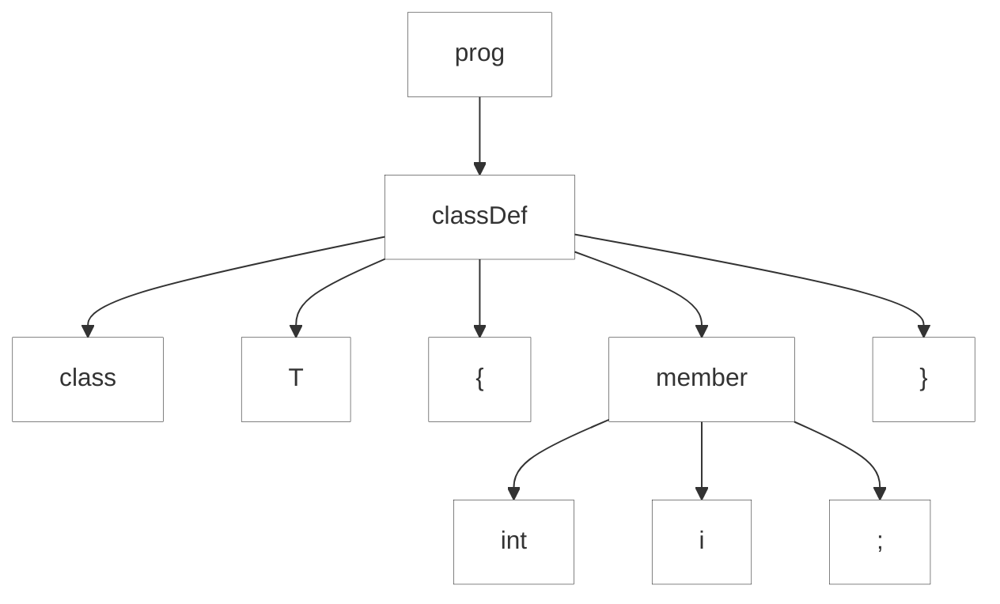
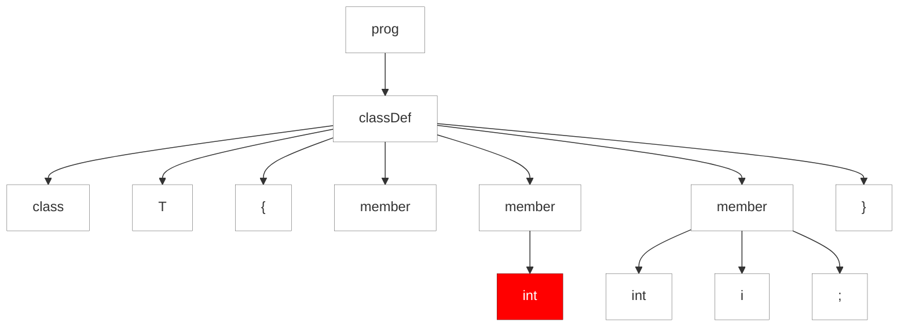

#### 9.3.5. Récupération d'Erreur "Fail-Safe"

Les analyseurs ANTLR ont une sécurité intégrée pour garantir la fin de la récupération des erreurs. Si nous atteignons le même emplacement de parser et avons la même position d'entrée, le parser force une consommation de jeton avant de tenter la récupération. Revenons à la grammaire simple `Simple` du début de ce chapitre et examinons un exemple d'entrée qui déclenche le dispositif de sécurité. Si nous ajoutons un token `int` supplémentaire dans une définition de champ, l'analyseur syntaxique détecte une erreur et tente de la récupérer. Comme nous le verrons dans le prochain test, l'analyseur syntaxique appelle `recover()` et essaie de relancer l'analyse plusieurs fois avant de se resynchroniser correctement.

https://github.com/Reefact/antlr4-book-examples/blob/a85936a9001fcac11b3e81239125568c1a489ae2/Reefact.BookExamples.Antlr4/Chapter_09/3/5/.resources/extra_int.simple#L1-L3
https://github.com/Reefact/antlr4-book-examples/blob/a85936a9001fcac11b3e81239125568c1a489ae2/Reefact.BookExamples.Antlr4/Chapter_09/3/5/Examples.cs#L19-L28
https://github.com/Reefact/antlr4-book-examples/blob/a85936a9001fcac11b3e81239125568c1a489ae2/Reefact.BookExamples.Antlr4/Chapter_09/3/5/Examples.extra_int_output.approved.txt#L1-L3

L'arbre d'analyse syntaxique de droite dans le diagramme de la Figure 10, _Arbres d'analyse syntaxique pour la bonne et la mauvaise syntaxe_, montre qu'il y a trois invocations de `member` de `classDef`.

__Good syntax__
https://github.com/Reefact/antlr4-book-examples/blob/96e7457e9ffce24b7ec2308cc8e7feb5ff6f5f29/Reefact.BookExamples.Antlr4/Chapter_09/3/5/Examples.cs#L30-L39

__Bad syntax__
https://github.com/Reefact/antlr4-book-examples/blob/96e7457e9ffce24b7ec2308cc8e7feb5ff6f5f29/Reefact.BookExamples.Antlr4/Chapter_09/3/5/Examples.cs#L41-L50

// to be continued
