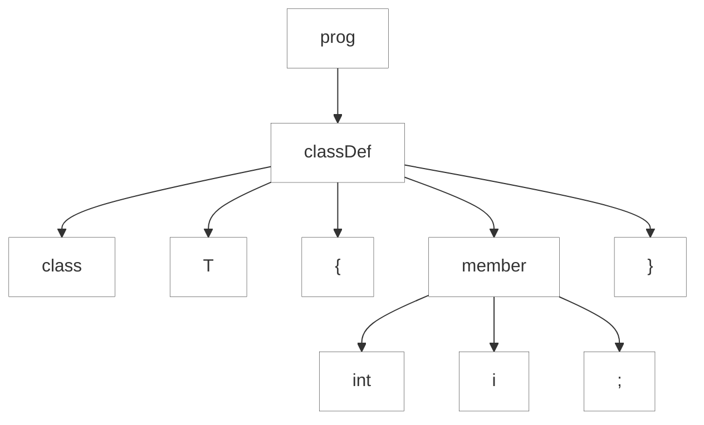
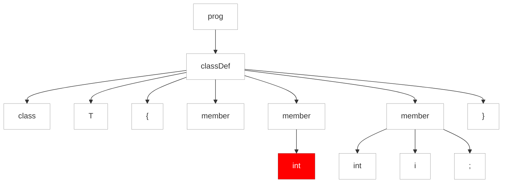

#### 9.3.5. Récupération d'Erreur "Fail-Safe"

Les analyseurs ANTLR ont une sécurité intégrée pour garantir la fin de la récupération des erreurs. Si nous atteignons le même emplacement de parser et avons la même position d'entrée, le parser force une consommation de jeton avant de tenter la récupération. Revenons à la grammaire simple `Simple` du début de ce chapitre et examinons un exemple d'entrée qui déclenche le dispositif de sécurité. Si nous ajoutons un token `int` supplémentaire dans une définition de champ, l'analyseur syntaxique détecte une erreur et tente de la récupérer. Comme nous le verrons dans le prochain test, l'analyseur syntaxique appelle `recover()` et essaie de relancer l'analyse plusieurs fois avant de se resynchroniser correctement.

https://github.com/Reefact/antlr4-book-examples/blob/a85936a9001fcac11b3e81239125568c1a489ae2/Reefact.BookExamples.Antlr4/Chapter_09/3/5/.resources/extra_int.simple#L1-L3
https://github.com/Reefact/antlr4-book-examples/blob/a85936a9001fcac11b3e81239125568c1a489ae2/Reefact.BookExamples.Antlr4/Chapter_09/3/5/Examples.cs#L19-L28
https://github.com/Reefact/antlr4-book-examples/blob/a85936a9001fcac11b3e81239125568c1a489ae2/Reefact.BookExamples.Antlr4/Chapter_09/3/5/Examples.extra_int_output.approved.txt#L1-L3

L'arbre d'analyse syntaxique de droite dans le diagramme de la Figure 10, _Arbres d'analyse syntaxique pour la bonne et la mauvaise syntaxe_, montre qu'il y a trois invocations de `member` de `classDef`.

__Good syntax__
https://github.com/Reefact/antlr4-book-examples/blob/96e7457e9ffce24b7ec2308cc8e7feb5ff6f5f29/Reefact.BookExamples.Antlr4/Chapter_09/3/5/Examples.cs#L30-L39

__Bad syntax__
https://github.com/Reefact/antlr4-book-examples/blob/96e7457e9ffce24b7ec2308cc8e7feb5ff6f5f29/Reefact.BookExamples.Antlr4/Chapter_09/3/5/Examples.cs#L41-L50

La première référence ne correspond à rien, mais la deuxième correspond à l'élément `int` surnuméraire. La troisième tentative de correspondance avec un membre correspond à la séquence `int x;` appropriée.

Passons en revue la séquence exacte des événements. L'analyseur syntaxique est dans la règle `member` quand il détecte la première erreur.

// todo: add code

L'entrée `int int` ne correspond à aucune des deux alternatives de `member`, donc l'analyseur syntaxique engage la stratégie de récupération d'erreur sync-and-return. Il émet le premier message d'erreur et consomme jusqu'à ce qu'il voit un jeton dans l'ensemble de resynchronisation pour la pile d'appels \[`prog`, `classDef`, `member`\].

A cause des boucles `classDef+` et `member+` dans la grammaire, le calcul de l'ensemble de resynchronisation est un peu compliqué. Après l'appel à `member`, l'analyseur syntaxique pourrait revenir en arrière et trouver un autre membre ou sortir de la boucle et trouver le `}` qui ferme la définition de la classe. Après l'appel à `classDef`, le parser pourrait revenir en arrière pour voir le début d'une autre classe ou simplement quitter `prog`. Ainsi, pour la pile d'appels \[`prog`, `classDef`, `member`\], l'ensemble de resynchronisation est `{'int', '}', 'class'}`.

A ce stade, le parser récupère sans consommer de jeton car le jeton d'entrée actuel, `int`, est dans l'ensemble de resynchronisation. Il retourne simplement à l'appelant : la boucle `member+` dans `classDef`. La boucle essaie alors de faire correspondre un autre membre. Malheureusement, comme elle n'a consommé aucun token, l'analyseur détecte une autre erreur lorsqu'elle retourne à `member` (bien qu'elle fasse taire le message d'erreur fallacieux, en vertu du flag `errorRecovery`).
Lors de la récupération de cette seconde erreur, le parser déclenche le fail-safe car il est arrivé au même emplacement de parser et à la même position d'entrée. Le fail-safe force une consommation de jeton avant de tenter une resynchronisation. Puisque `int` est dans l'ensemble de resynchronisation, il ne consomme pas de deuxième jeton. Heureusement, c'est exactement ce que nous voulons car l'analyseur syntaxique est maintenant correctement resynchronisé. Les trois jetons suivants représentent une définition de membre valide : `int x;`. L'analyseur syntaxique retourne une fois de plus de `member` à la boucle dans `classDef`. Pour la troisième fois, nous retournons à `member`, mais maintenant l'analyse syntaxique va réussir.

Ainsi, c'est l'histoire du mécanisme de récupération automatique des erreurs d'ANTLR. Maintenant, regardons un mécanisme manuel qui peut parfois fournir une meilleure récupération d'erreur.

⏭ Chapitre suivant: [9.4. Alternatives d'Erreurs](../../4)
